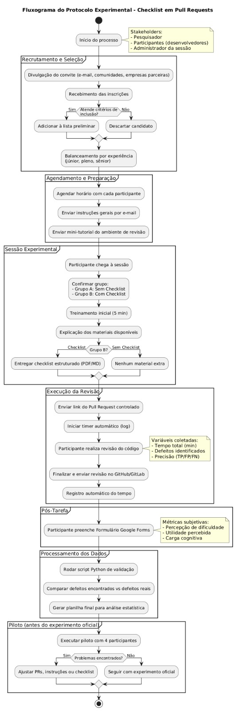

# Plano de Experimento — Seções 1 a 20

## 1. Identificação básica

### 1.1 Título do experimento

**Impacto do uso de checklist estruturado em revisões de código (pull requests) sobre a detecção de defeitos e o tempo de revisão**

*Justificativa do título:* título claro e descritivo que informa o que será comparado (revisão de código com checklist estruturado vs. revisão de código sem checklist), quais resultados serão medidos (detecção de defeitos e tempo de revisão) e o contexto operacional (pull requests / revisões em repositórios de software).

### 1.2 ID / código

**TCC-EXP-ENGSW-2025-001**

### 1.3 Versão do documento e histórico de revisão

- **Versão:** v5.0  
- **Histórico de revisão:**  
  - v1.0 (2025-11-21) — Criação inicial do plano com Seções 1 e 2 concluídas.
  - v2.0 (2025-11-25) - Seções 3 a 6 adicionadas.
  - v3.0 (2025-11-28) - Seções 7 a 9 e tabelas adicionadas.
  - v4.0 (2025-12-02) - Seções 10 a 12 adicionadas.
  - v5.0 (2025-12-5) - Seções 13 e 14 até 20 adicionadas, mudança no fluxograma e vídeo

### 1.4 Datas (criação, última atualização)

- **Data de criação:** 21 de novembro de 2025  
- **Data da última atualização:** 5 de dezembro de 2025

### 1.5 Autores (nome, área, contato)

- **Amanda Bicalho Silva** — Engenharia de Software (graduanda).  
  Contato: *amanda.bicalho@sga.pucminas.br*.  
- Orientador(a) / coautor(a) — Danilo de Quadros Maia Filho.

### 1.6 Responsável principal (PI / dono do experimento)

- **Amanda Bicalho Silva** — estudante responsável pelo desenho e execução do experimento.

### 1.7 Projeto / produto / iniciativa relacionada

- **Projeto/Disciplina:** Trabalho Final da disciplina Medição e Experimentação em Engenharia de Software — Curso de Engenharia de Software, PUC Minas.
- **Conexão com iniciativas:** possível integração com repositório do TCC, projetos de extensão ou equipe júnior.

---

## 2. Contexto e problema

### 2.1 Descrição do problema / oportunidade

**Problema:**  
Revisões de código são fundamentais para detectar defeitos e melhorar qualidade, mas revisões informais e não estruturadas apresentam grande variabilidade, com revisores esquecendo itens importantes, focando apenas em estilo, deixando passar defeitos ou gastando mais tempo que o necessário.

**Oportunidade:**  
Um checklist estruturado pode padronizar o processo, aumentar a taxa de detecção de defeitos relevantes e reduzir o tempo de revisão. É uma intervenção simples, de baixo custo e adequada tanto ao ambiente acadêmico quanto profissional.

**Sinais observados (motivação prática):**

- Comentários repetitivos em vários PRs.
- Bugs descobertos em testes que passaram despercebidos pelo revisor.
- Revisões demoradas, atrasando merges.

**Impacto esperado:**  
Melhor detecção precoce de defeitos, redução de retrabalho e padronização do processo de revisão.

### 2.2 Contexto organizacional e técnico

**Ambiente proposto:**

- **Cenário:** ambiente acadêmico (disciplina de Engenharia de Software) ou equipe pequena de desenvolvimento.
- **Participantes:** desenvolvedores/estudantes com experiência básica em Git/GitHub/GitLab.
- **Ferramentas:** Git, GitHub/GitLab, diffs, PR logs, planilhas e formulários de coleta.
- **Processo:** feature branches, pull requests e revisões manuais peer review.
- **Restrições:** não usar ferramentas automatizadas que substituam itens do checklist.
- **Modo de execução:** revisões assíncronas (48h) ou sessões controladas presenciais.

### 2.3 Trabalhos e evidências prévias (internos e externos)

**Evidências internas:**

- Histórico de PRs em projetos acadêmicos.
- Observação de variação na qualidade das revisões entre alunos.

**Evidências externas:**

- Estudos clássicos de inspeção de software (ex.: Fagan).
- Pesquisas que mostram que checklists aumentam eficácia em inspeções.
- Trabalhos sobre práticas de code review, variabilidade entre revisores e carga cognitiva.

### 2.4 Referencial teórico e empírico essencial

1. **Inspeção estruturada e checklists:** ajudam a padronizar observações e reduzir erros de omissão.
2. **Variabilidade humana e carga cognitiva:** checklists reduzem carga mental e aumentam profundidade da análise.
3. **Economia do defeito:** defeitos descobertos cedo têm menor custo.
4. **Métricas de revisão:** taxa de detecção de defeitos, tempo de revisão, número de comentários, reabertura de PRs.
5. **Validade e generalização:** efeitos do checklist podem variar conforme experiência do revisor e complexidade do código.

---


# 3. Objetivos e Questões (Goal / Question / Metric)

## 3.1 Objetivo Geral (Goal Template)

Analyze **o uso de um checklist estruturado para code review**  
for the purpose of **avaliar sua eficácia na melhoria da qualidade da revisão de código**  
with respect to **precisão, completude, padronização e eficiência**  
from the point of view of **revisores, desenvolvedores e líderes técnicos**  
in the context of **projetos de software acadêmicos e profissionais com equipes de diferentes níveis de experiência**.

---

## 3.2 Objetivos Específicos

- **O1.** Avaliar se o checklist aumenta a precisão da identificação de defeitos durante o code review.  
- **O2.** Avaliar se o checklist melhora a completude da revisão, reduzindo itens não verificados.  
- **O3.** Avaliar o impacto do checklist no tempo da revisão e na necessidade de retrabalho.  
- **O4.** Avaliar a percepção dos revisores quanto à utilidade e facilidade de uso do checklist.  
- **O5.** Comparar a consistência entre diferentes revisores utilizando o checklist.

---

## 3.3 Questões de Pesquisa / de Negócio

- **Q1.** O checklist aumenta o número de defeitos reais identificados?  
- **Q2.** O checklist reduz falsos positivos?  
- **Q3.** Revisões feitas com checklist cobrem mais itens essenciais?  
- **Q4.** Revisores deixam menos itens sem verificação ao usar checklist?  
- **Q5.** O checklist aumenta ou reduz o tempo total da revisão?  
- **Q6.** O checklist reduz a necessidade de revisões adicionais?  
- **Q7.** O checklist é considerado útil pelos revisores?  
- **Q8.** O checklist facilita a tomada de decisão e aumenta a confiança dos revisores?  
- **Q9.** Revisores diferentes produzem resultados mais consistentes quando usam o checklist?

---

## 3.4 Métricas Associadas (GQM)

### Tabela GQM — Métricas por Pergunta

| Questão | Métricas                    | Definição                                    | Unidade    | Fonte                    |
| ------- | --------------------------- | -------------------------------------------- | ---------- | ------------------------ |
| Q1      | M1: Defeitos verdadeiros    | Número de defeitos reais encontrados         | Contagem   | Logs de revisão          |
| Q1      | M3: Defeitos críticos (%)   | Proporção de defeitos críticos               | %          | Análise de severidade    |
| Q2      | M2: Falsos positivos        | Problemas sinalizados incorretamente         | Contagem   | Logs de revisão          |
| Q3      | M4: Cobertura de itens (%)  | Percentual de itens do checklist verificados | %          | Checklist preenchido     |
| Q4      | M5: Itens ignorados         | Itens não verificados                        | Contagem   | Checklist preenchido     |
| Q5      | M6: Tempo total             | Tempo gasto para concluir o review           | Minutos    | Ferramenta de tracking   |
| Q6      | M7: Revisões adicionais     | Número de revisões extras                    | Contagem   | Histórico de tarefas     |
| Q7      | M8: Nota de utilidade       | Avaliação subjetiva dos revisores            | Escala 1–5 | Questionário             |
| Q8      | M9: Índice de confiança     | Percepção de segurança na decisão            | Escala 1–5 | Questionário             |
| Q9      | M10: Índice de consistência | Similaridade entre revisores                 | %          | Comparação entre reviews |

---

# 4. Escopo e Contexto do Experimento

## 4.1 Escopo Funcional / de Processo (Incluído e Excluído)

### **Incluído**
- Processo de *code review* aplicado ao módulo X do projeto.  
- Uso de checklist estruturado para validação do código.  
- Participação de revisores com diferentes níveis de experiência.  
- Coleta de dados de tempo, defeitos e percepções.

### **Excluído**
- Alterações no processo de desenvolvimento como um todo.  
- Avaliação de performance do sistema.  
- Intervenção no código além da revisão.  
- Revisões automatizadas por ferramentas estáticas.

---

## 4.2 Contexto do Estudo

- **Tipo de organização:** ambiente acadêmico/profissional híbrido.  
- **Projeto:** sistema modular de médio porte com requisitos estáveis.  
- **Tamanho da equipe:** 6 a 10 participantes.  
- **Experiência dos participantes:** intermediária, com conhecimento prévio de Git e revisão de código.  
- **Criticidade:** média — impacto moderado caso defeitos passem.

---

## 4.3 Premissas

- Checklist estará disponível e acessível para todos.  
- Participantes seguirão o checklist corretamente.  
- Ambiente de desenvolvimento permanecerá estável.  
- Tempo suficiente será alocado para realização das revisões.

---

## 4.4 Restrições

- Janela limitada de tempo para execução.  
- Ferramentas obrigatórias definidas pela organização.  
- Participantes podem ter cargas de trabalho variáveis.  
- Não é possível expandir o tamanho da amostra.

---

## 4.5 Limitações Previstas

- Diferença de experiência pode impactar resultados.  
- Resultados podem não generalizar para equipes grandes.  
- Checklist analisado pode não ser adequado para todo tipo de projeto.  
- Amostra pode ser pequena para conclusões estatísticas amplas.

---

# 5. Stakeholders e Impacto Esperado

## 5.1 Stakeholders Principais

- Desenvolvedores  
- Revisores  
- QA  
- Gerentes técnicos / Tech Leads  
- Equipe de produto  

---

## 5.2 Interesses e Expectativas dos Stakeholders

- **Desenvolvedores:** receber feedback mais útil e padronizado.  
- **Revisores:** ter maior apoio na identificação de problemas.  
- **QA:** redução de defeitos em testes.  
- **Gestores:** maior eficiência, menos retrabalho e previsibilidade.  
- **Produto:** melhoria de qualidade percebida.

---

## 5.3 Impactos Potenciais no Processo / Produto

- Possível aumento inicial no tempo de revisão.  
- Redução de bugs em versões posteriores.  
- Padronização do processo de review.  
- Aumento de carga para revisores menos experientes.

---

# 6. Riscos de Alto Nível, Premissas e Critérios de Sucesso

## 6.1 Riscos de Alto Nível

- Inconsistência no uso do checklist.  
- Falta de disponibilidade dos participantes.  
- Perda de dados por falha de ferramenta.  
- Resistência cultural ao uso do checklist.  
- Qualidade do código analisado variar demais.

---

## 6.2 Critérios de Sucesso Globais (Go / No-Go)

- Pelo menos **80% de adesão** ao checklist.  
- **Aumento de 20%** na identificação de defeitos reais.  
- Redução de falsos positivos.  
- Alta percepção de utilidade (**média ≥ 4**).

---

## 6.3 Critérios de Parada Antecipada

- Indisponibilidade de participantes-chave.  
- Falha crítica no ambiente de desenvolvimento.  
- Cancelamento do projeto ou mudança completa de escopo.  
- Identificação de viés severo que invalide o experimento.

# 7. Modelo Conceitual e Hipóteses

## 7.1 Modelo Conceitual do Experimento
O modelo conceitual parte da ideia de que revisões de código estruturadas, guiadas por um checklist, aumentam a precisão e consistência do processo de revisão. A utilização de listas de verificação reduz omissões cognitivas, padroniza critérios de inspeção e aumenta a probabilidade de identificar problemas que revisores poderiam ignorar espontaneamente.

Sem checklist, o processo é altamente dependente da experiência e memória do revisor; com checklist, há um apoio cognitivo explícito, reduzindo variabilidade entre revisores.

**Relações esperadas no modelo:**
- **Checklist → Aumento da detecção de defeitos**
- **Checklist → Aumento moderado do tempo de revisão**
- **Checklist → Melhor consistência entre revisores**
- **Experiência do revisor (variável de bloqueio)** impacta eficiência e velocidade, mas será controlada.

```
Uso de Checklist ───► Aumento de defeitos detectados
        │
        └───────────► Aumento previsível do tempo de revisão
```

## 7.2 Hipóteses Formais (H0 e H1)

### Hipótese 1 — Detecção de Defeitos
- **H0₁:** O uso do checklist não aumenta significativamente o número de defeitos detectados.
- **H1₁:** O uso do checklist aumenta significativamente o número de defeitos detectados.

### Hipótese 2 — Tempo de Revisão
- **H0₂:** O uso do checklist não altera significativamente o tempo médio de revisão.
- **H1₂:** O uso do checklist aumenta significativamente o tempo médio de revisão.

### Hipótese 3 — Consistência entre Revisores
- **H0₃:** Não há diferença significativa na variabilidade da detecção de defeitos entre revisores com e sem checklist.
- **H1₃:** Revisores usando checklist apresentam menor variabilidade entre si.

## 7.3 Nível de Significância e Poder
- **Nível de significância:** α = 0,05  
- **Poder estatístico desejado:** ≥ 0,8

Estratégias de mitigação em caso de amostra pequena:
- aumentar o número de tarefas por participante;
- usar desenho com blocos.

# 8. Planejamento Experimental

## 8.1 Unidade Experimental
A unidade experimental neste estudo é **cada revisor individual**, responsável por avaliar um pull request (PR) seguindo um dos tratamentos definidos (com checklist ou sem checklist).  
Cada participante executará revisões **individualmente**, permitindo comparar o desempenho entre diferentes níveis de experiência e diferentes tratamentos.

---

## 8.2 Objeto
O objeto do experimento é o **processo de revisão de código** realizado sobre um pull request em um repositório simulado contendo **defeitos previamente inseridos** de forma controlada.

Os PRs utilizados terão **complexidade e tamanho semelhantes**, variando apenas nos defeitos introduzidos, garantindo comparabilidade entre os tratamentos.

---

## 8.3 Fatores
Os fatores definidos para o estudo são:

| **Fator**              | **Tipo**    | **Níveis / Tratamentos**                |
|------------------------|-------------|------------------------------------------|
| Uso de Checklist       | Principal   | Com checklist / Sem checklist            |
| Experiência do Revisor | Bloqueio    | Júnior / Pleno / Sênior                  |

O fator principal é **uso de checklist**, cujo impacto deseja-se observar sobre tempo e detecção de defeitos.

---

## 8.4 Tratamentos

### **Tratamento 1 — Sem Checklist**
Revisão realizada de forma livre, sem estruturação ou apoio.

### **Tratamento 2 — Com Checklist**
Revisor utiliza um checklist estruturado com itens como:
- consistência de nomes  
- tratamento de erros  
- aderência a padrões de estilo  
- funções muito longas  
- cobertura de testes  
- comentários desnecessários ou ausentes  

### **Tabela de Fatores, Tratamentos e Combinações**

| **Fator**              | **Níveis / Tratamentos** | **Descrição**                                   | **Combinações**            |
|------------------------|---------------------------|--------------------------------------------------|-----------------------------|
| Uso do Checklist       | Com checklist             | Uso de checklist estruturado                    | Com checklist               |
|                        | Sem checklist             | Revisão livre                                    | Sem checklist               |
| Experiência do Revisor | Júnior                    | < 2 anos de experiência                           |                             |
|                        | Pleno                     | 2–5 anos                                          | **2 × 3 = 6 combinações**  |
|                        | Sênior                    | > 5 anos                                          |                             |

### **Combinações resultantes**
- Com checklist + Júnior  
- Com checklist + Pleno  
- Com checklist + Sênior  
- Sem checklist + Júnior  
- Sem checklist + Pleno  
- Sem checklist + Sênior  

**Total: 6 combinações experimentais.**

---

## 8.5 Variáveis Dependentes

| **Variável**                    | **Definição**                             | **Unidade**      |
|---------------------------------|---------------------------------------------|------------------|
| Defeitos corretamente detectados | Número de defeitos reais encontrados       | Contagem         |
| Tempo total de revisão           | Tempo gasto na revisão                     | Minutos          |
| Precisão                         | Defeitos corretos / defeitos relatados     | Proporção        |
| Consistência                     | Variação entre participantes               | Desvio-padrão    |

---

## 8.6 Variáveis do Experimento (Todas)

| **Variável**               | **Tipo**                        | **Descrição**                                              | **Unidade / Medição**              |
|----------------------------|----------------------------------|-------------------------------------------------------------|-------------------------------------|
| Uso do Checklist           | Independente (Fator)             | Indica se o revisor usa checklist estruturado              | Com / sem checklist                 |
| Tempo de Revisão           | Dependente                       | Tempo gasto no PR                                           | Minutos                             |
| Defeitos Detectados        | Dependente                       | Número de defeitos identificados                            | Contagem                            |
| Severidade dos Defeitos    | Dependente (opcional)            | Classificação dos defeitos                                  | Baixo / Médio / Alto                |
| Tamanho do PR              | Controle                         | Linhas de código alteradas                                 | LOC                                 |
| Complexidade do Código     | Controle                         | Complexidade ciclomática                                    | Índice                              |
| Experiência do Revisor     | Bloqueio / Controle              | Júnior, Pleno, Sênior                                       | Categoria                           |
| Tipo de Mudança            | Controle                         | Tipo da alteração (bugfix, refatoração, feature)           | Categoria                           |
| Familiaridade com o código | Confusão possível                | Grau de conhecimento do módulo alterado                    | Baixa / Média / Alta                |
| Pressão de Tempo           | Confusão possível                | Percepção de urgência da tarefa                             | Baixa / Média / Alta                |


## 8.7 Variáveis de Confusão
- Motivação/fadiga  
- Familiaridade prévia  
- Estratégias pessoais  
- Ritmo natural  
- Horário  

# 9. Desenho Experimental

## 9.1 Tipo de Desenho
**Desenho em blocos aleatorizados** com blocos por experiência.

## 9.2 Randomização
- Classificar participantes por experiência  
- Sortear para:
  - **Grupo A:** checklist → sem checklist  
  - **Grupo B:** sem checklist → checklist  
- PRs também são randomizados

## 9.3 Balanceamento e Contrabalanço
- Mesmo número de participantes por grupo  
- Metade inicia com checklist, metade sem  
- PRs trocados entre grupos

## 9.4 Número de Grupos e Sessões
- **Grupos:** A e B  
- **Sessões:** 2 por participante  
- **Duração:** 20–25 min cada

# 10. População, Sujeitos e Amostragem

## 10.1 População-alvo
A população-alvo deste experimento consiste em **desenvolvedores de software envolvidos em revisões de código (pull requests)** em contextos reais de desenvolvimento. Mais especificamente:

- Desenvolvedores que utilizam **GitHub/GitLab/Bitbucket** em seu fluxo de trabalho.
- Profissionais que atuam em **times ágeis ou squads de produto**.
- Linguagens-alvo do estudo: **JavaScript/TypeScript, Java ou Python**.

O experimento busca representar profissionais que executam revisões com alguma regularidade, mas com variação natural de experiência (júnior, pleno e sênior).

---

## 10.2 Critérios de Inclusão
Um participante será elegível se atender aos seguintes critérios mínimos:

- Ter realizado **pelo menos 5 revisões de código** nos últimos 6 meses.
- Ter familiaridade com ferramentas de versionamento Git.
- Ter experiência com leitura e compreensão de código.
- Estar disponível para realizar a atividade em sessão única de 30–45 min.
- Concordar com o termo de participação (quando aplicável — ambiente acadêmico ou corporativo).

---

## 10.3 Critérios de Exclusão
São excluídos participantes que:

- Nunca realizaram revisão de código na prática.
- Não possuem tempo disponível para completar todas as etapas da sessão.
- Participaram do **piloto** (evitar contaminação por prévia exposição aos materiais).
- Possuem conflito direto com o experimento (por exemplo, ajudaram a criar os PRs usados no estudo).

---

## 10.4 Tamanho da Amostra Planejado
O experimento prevê:

- **30 participantes no total**, distribuídos de forma balanceada:  
  - 15 no grupo *Com Checklist*  
  - 15 no grupo *Sem Checklist*

Dentro de cada grupo, pretende-se manter diversidade de níveis de experiência:

- 5 júnior  
- 5 pleno  
- 5 sênior  

Este tamanho foi definido considerando:

- Recursos disponíveis (tempo e logística).
- Possibilidade de conduzir ANOVA com poder estatístico mínimo.
- Estudos semelhantes na literatura com amostras de 24–32 participantes.

---

## 10.5 Método de Seleção / Recrutamento
O recrutamento será feito por **amostragem por conveniência**, utilizando:

- Convite enviado a desenvolvedores de empresas parceiras.
- Divulgação entre ex-alunos de Engenharia de Software.
- Voluntários de comunidades online de Git e revisão de código.

A seleção respeitará **ordem de resposta**, garantindo distribuição equilibrada de experiência.

---

## 10.6 Treinamento e Preparação dos Sujeitos
Antes da execução, todos os participantes receberão:

- **Guia de instruções** sobre o objetivo geral da tarefa (sem revelar hipóteses).
- **Mini-tutorial do ambiente de revisão**.
- **Exemplo de PR** simples para familiarização com a interface.

Participantes do grupo *Com Checklist* receberão:

- Explicação breve sobre uso do checklist.

Participantes do grupo *Sem Checklist* receberão:

- Apenas instruções-padrão da tarefa.

---

# 11. Instrumentação e Protocolo Operacional

## 11.1 Instrumentos de Coleta
| Instrumento           | Tipo              | Função                                              |
| --------------------- | ----------------- | --------------------------------------------------- |
| PRs simulados         | Arquivos/Repo Git | Contêm defeitos controlados para revisão.           |
| Checklist estruturado | PDF/Markdown      | Orienta revisores do grupo experimental.            |
| Formulário pós-tarefa | Google Forms      | Coleta opinião, percepção e dificuldades.           |
| Planilha de Log       | Automático        | Registra tempo total gasto (início/fim).            |
| Script de validação   | Python            | Compara defeitos relatados com defeitos existentes. |

---

## 11.2 Materiais de Suporte
- Documento de **instruções gerais**.
- Guia rápido do ambiente GitHub.
- Passo a passo para envio da revisão.
- Para administradores: checklist de operação da sessão.

---

## 11.3 Procedimento Experimental — Passo a Passo (Protocolo)
1. **Convite e agendamento** dos participantes.  
2. **Recebimento das instruções gerais** por e-mail.  
3. **Chegada à sessão** e confirmação do grupo (Checklist / Sem Checklist).  
4. **Treinamento inicial** (5 min):  
   - uso do ambiente,  
   - materiais permitidos.  
5. **Início da tarefa**:  
   - participante recebe o link do PR correspondente.  
   - participante inicia o timer automático.  
6. **Execução da revisão**:  
   - Grupo A: revisão livre.  
   - Grupo B: revisão com checklist.  
7. **Envio da revisão**.  
8. **Registro automático do tempo**.  
9. **Preenchimento do formulário pós-tarefa**.  
10. **Encerramento e agradecimento**.  
11. **Armazenamento dos dados** para análise.

---

## 11.4 Plano de Piloto
O piloto será realizado com **4 participantes** (2 com checklist, 2 sem). Objetivos:

- Identificar problemas de usabilidade no ambiente.
- Verificar clareza das instruções.
- Verificar se o tempo estimado é realista.
- Avaliar se os PRs possuem dificuldade equivalente.

Ajustes possíveis:

- Reformulação de instruções.
- Ajuste da complexidade dos PRs.
- Revisão do checklist.
- Correção de falhas no script de coleta.

---

## Fluxograma do Experimento (Operacional)





---

# 12. Plano de Análise de Dados (Pré-execução)

## 12.1 Estratégia Geral de Análise
Os dados serão utilizados para responder às questões principais:

1. **O uso de checklist aumenta a detecção de defeitos?**  
   - Comparação entre grupos.
2. **O checklist altera o tempo de revisão?**  
   - Análise de médias e variâncias.
3. **A experiência do revisor influencia os efeitos do checklist?**  
   - Interações fatoriais.

A análise seguirá estas etapas:

- limpeza dos dados;
- consolidação em planilha única;
- análise exploratória (gráficos, boxplots);
- aplicação de testes estatísticos;
- interpretação dos resultados.

---

## 12.2 Métodos Estatísticos Planejados
- **ANOVA bifatorial** (Checklist × Experiência) para:  
  - tempo de revisão,  
  - defeitos detectados.
- **Testes t** (pós-hoc) quando necessário.
- **Correção de múltiplas comparações** (Tukey HSD).
- **Análise de normalidade** (Shapiro-Wilk).
- Se os dados não forem normais:  
  - **Mann-Whitney** (2 grupos),  
  - **Kruskal-Wallis** (3 níveis de experiência).

---

## 12.3 Tratamento de Dados Faltantes e Outliers
Regras pré-definidas:

- Dados faltantes em variáveis essenciais → remover participante.
- Outliers serão detectados por:  
  - **IQR (1.5×)**,  
  - inspeção visual.
- Outliers serão mantidos se representarem comportamento legítimo.

---

## 12.4 Plano de Análise para Dados Qualitativos
Para comentários qualitativos:

- Codificação aberta das respostas.
- Agrupamento por temas (ex.: dificuldade, clareza, carga cognitiva).
- Análise de frequência das categorias.
- Comparação entre grupos quando fizer sentido.

# 13. Avaliação de Validade (Ameaças e Mitigação)

## 13.1 Validade de Conclusão

A validade de conclusão se refere à robustez das inferências estatísticas — isto é, se as conclusões sobre relacionamentos, diferenças ou efeitos são confiáveis. As principais ameaças e respectivas estratégias de mitigação são:

### **Ameaças**

* **Baixo poder estatístico** devido a tamanho de amostra insuficiente.
* **Violação de suposições estatísticas** (normalidade, homogeneidade) que podem invalidar testes paramétricos.
* **Erros de medida** nas métricas coletadas (tempo de revisão, defeitos detectados) por inconsistência nos instrumentos.
* **Variabilidade excessiva entre participantes**, principalmente por diferenças de experiência.

### **Mitigação**

* Definição prévia de tamanho mínimo de amostra considerando poder desejado (≥ 0,8).
* Uso de **testes não paramétricos** quando suposições forem violadas (ex.: Mann-Whitney, Kruskal-Wallis).
* Instrumentação padronizada: logs automáticos, formulários alinhados, validação prévia dos dados.
* Uso de **blocos por experiência** e análise estratificada.

---

## 13.2 Validade Interna

A validade interna avalia se a relação observada entre tratamento e resposta realmente reflete causalidade, e não causas alternativas.

### **Ameaças**

* **History:** fatores externos que afetam participantes durante o experimento.
* **Maturation:** cansaço, melhora natural ou aprendizado durante o experimento.
* **Selection bias:** grupos desbalanceados em experiência ou familiaridade.
* **Instrumentation:** diferenças entre versões de formulários ou instruções.
* **Testing effect:** familiarização com tarefas após primeira exposição.

### **Mitigação**

* Execução do experimento em sessão controlada e com duração limitada para reduzir fatores externos.
* Aplicação de **contrabalanço** (ordem aleatória de tarefas quando houver mais de um PR).
* Randomização completa na alocação ao grupo “Com checklist” e “Sem checklist”.
* Uso de um **protocolo padronizado** para todos os participantes.
* Treinamento inicial equivalente antes da execução das tarefas.

---

## 13.3 Validade de Constructo

A validade de constructo trata de verificar se os instrumentos e métricas realmente medem os conceitos que afirmam medir.

### **Ameaças**

* Métricas de defeitos podem não refletir corretamente “qualidade da revisão”.
* Tempo total pode não representar “esforço cognitivo”.
* Checklist pode ser interpretado de formas diferentes pelos participantes.
* Conceitos de “experiência júnior/pleno/sênior” podem conter ambiguidades.

### **Mitigação**

* Definição operacional explícita de cada métrica e variável.
* Checklist padronizado e validado previamente em piloto.
* Uso de instruções detalhadas para evitar interpretações múltiplas.
* Registro automático de tempo para evitar subjetividade.
* Classificação de experiência baseada em critérios objetivos (anos + tipos de projetos).

---

## 13.4 Validade Externa

A validade externa avalia a capacidade de generalizar os resultados para outros contextos organizacionais, tecnológicos ou humanos.

### **Ameaças**

* Amostra restrita (ex.: estudantes ou somente um time/empresa).
* Tipo de PR utilizado pode não representar PRs reais do mercado.
* Checklist pode não se adequar a todas as linguagens ou estilos.
* Ambiente de experimento pode não reproduzir pressões reais de tempo.

### **Mitigação**

* Selecionar PRs representativos de cenários reais em empresas.
* Descrever claramente o contexto para permitir replicação.
* Usar participantes com diferentes níveis de experiência.
* Replicar o experimento em diferentes times/organizações (futuro).

---

## 13.5 Resumo das Principais Ameaças e Estratégias de Mitigação

| Tipo de Validade | Ameaças Principais                                             | Estratégias de Mitigação                                                         |
| ---------------- | -------------------------------------------------------------- | -------------------------------------------------------------------------------- |
| **Conclusão**    | Baixo poder, violações de suposições, erro de medida           | Tamanho de amostra adequado, testes não paramétricos, instrumentação padronizada |
| **Interna**      | Causas externas, seleção desigual, learning effect             | Randomização, contrabalanço, protocolo padronizado, treinamento                  |
| **Constructo**   | Métricas pouco representativas, interpretações ambíguas        | Definições operacionais claras, checklist validado, instruções detalhadas        |
| **Externa**      | Amostra pouco representativa, PR artificial, contexto limitado | Seleção de PRs reais, detalhamento de contexto, diversidade de participantes     |

Link vídeo: https://drive.google.com/file/d/1IQ274ucM6QHPHj368Fmkb0efEOItuwps/view?usp=sharing
---

# 14. Ética, Privacidade e Conformidade

## 14.1 Questões Éticas

* Garantir participação voluntária, sem coerção ou pressão.
* Evitar que estudantes sintam obrigação de participar para obter nota.
* Prevenir riscos de exposição de informações sensíveis dos participantes.
* Definir políticas claras para incentivos (se existirem), evitando influência indevida.
* Garantir que a participação não gere riscos materiais, emocionais ou profissionais aos sujeitos.

## 14.2 Consentimento Informado

* Apresentar documento com objetivos, procedimentos, riscos e benefícios.
* Explicar que a participação é voluntária e que o participante pode desistir a qualquer momento.
* Indicar como os dados serão usados, armazenados, protegidos e posteriormente descartados.
* Obter registro formal do consentimento (assinatura física ou digital).

## 14.3 Privacidade e Proteção de Dados

* Coletar somente dados estritamente necessários.
* Aplicar anonimização ou pseudoanonimização de identificadores pessoais.
* Armazenar dados em repositórios privados com acesso controlado.
* Estabelecer tempo de retenção limitado e seguro.
* Garantir conformidade com LGPD.

## 14.4 Aprovações Necessárias

* Comitê de Ética ou CEP institucional (se aplicável).
* Jurídico ou Compliance da organização.
* Data Protection Officer (DPO).
* Gestores responsáveis pelo ambiente experimental.

# 15. Recursos, Infraestrutura e Orçamento

## 15.1 Recursos Humanos e Papéis

* **Pesquisador Principal:** coordenação geral, decisões e supervisão.
* **Coletor de Dados:** administração do experimento e registro de métricas.
* **Analista de Dados:** tratamento estatístico e interpretação.
* **Avaliador Técnico:** suporte para configuração de ambientes.

## 15.2 Infraestrutura Técnica Necessária

* Repositório Git (GitHub/GitLab).
* Ferramentas de coleta de logs.
* Plataforma de questionários.
* Ambientes de desenvolvimento padronizados.
* Servidor/VM para armazenamento dos dados coletados.

## 15.3 Materiais e Insumos

* Computadores com acesso ao repositório.
* Licenças de software (se necessário).
* Formulários digitais.
* Documentos de instrução e checklist.

## 15.4 Orçamento e Custos Estimados

* Custos com pessoal (horas dedicadas).
* Licenças ou serviços de nuvem.
* Materiais de apoio.
* Reserva orçamentária institucional.

# 16. Cronograma, Marcos e Riscos Operacionais

## 16.1 Macrocronograma

* Semana 1: Revisão final do plano.
* Semana 2: Aprovação ética e jurídica.
* Semana 3: Treinamento dos participantes.
* Semana 4: Execução do piloto.
* Semana 5: Ajustes do protocolo.
* Semana 6: Início da execução oficial.

## 16.2 Dependências

* Treinamento depende da aprovação ética.
* Execução depende do piloto.
* Análise depende da coleta de dados concluída.

## 16.3 Riscos Operacionais e Contingência

* **Baixa adesão:** recrutar participantes adicionais.
* **Problemas técnicos:** equipe de TI de prontidão.
* **Atrasos no cronograma:** replanejamento com margens de segurança.

# 17. Governança do Experimento

## 17.1 Papéis e Responsabilidades

* **Decisores:** pesquisador principal e supervisor.
* **Executores:** facilitadores e coletores de dados.
* **Revisores:** equipe técnica e metodológica.
* **Informados:** participantes, coordenação, TI.

## 17.2 Ritos de Acompanhamento

* Reuniões semanais de alinhamento.
* Checkpoints a cada marco do cronograma.
* Revisões metodológicas antes de ajustes.

## 17.3 Controle de Mudanças

* Propostas registradas em documento formal.
* Avaliação técnica e ética antes de aprovação.
* Registro histórico das alterações.

# 18. Plano de Documentação e Reprodutibilidade

## 18.1 Repositórios e Nomeação

* Repositório privado com convenções padronizadas.
* Diretórios: `/plano/`, `/instrumentos/`, `/scripts/`, `/dados/`.

## 18.2 Templates e Artefatos

* Modelos de questionários.
* Guias operacionais.
* Checklists estruturados.
* Scripts de coleta e análise.

## 18.3 Empacotamento para Replicação

* Documentação completa do protocolo.
* Scripts automatizados.
* Instruções de instalação.
* Guia para replicação futura.

# 19. Plano de Comunicação

## 19.1 Públicos e Mensagens

* Participantes: objetivos, expectativas e datas.
* Gestores: escopo, riscos e resultados esperados.
* TI: infraestrutura e suporte necessário.

## 19.2 Canais e Frequência

* E-mail semanal.
* Reuniões quinzenais.
* Canal dedicado no Teams/Slack.

## 19.3 Pontos Obrigatórios

* Aprovação do plano.
* Mudanças estruturais.
* Início e encerramento da execução.

# 20. Critérios de Prontidão (Definition of Ready)

## 20.1 Checklist de Prontidão

* Aprovação ética.
* Instrumentos finalizados.
* Participantes recrutados.
* Infraestrutura configurada.
* Comunicação inicial enviada.

## 20.2 Aprovações Finais

* Pesquisador responsável.
* Comitê de Ética.
* Gestor do projeto.
* Registro formal via documento assinado ou sistema institucional.


```md
